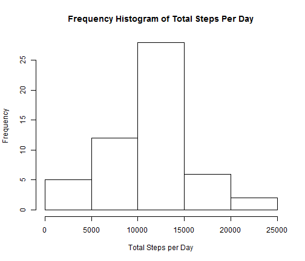
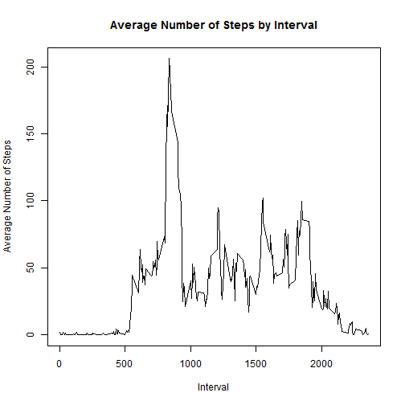
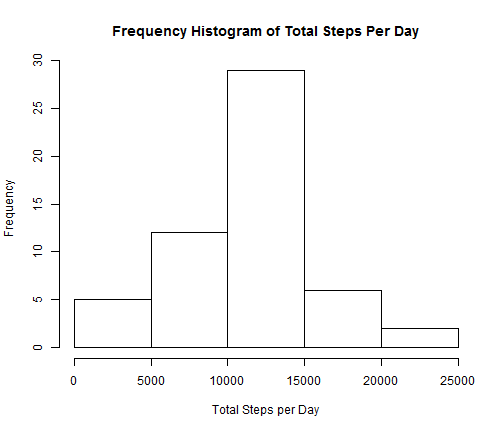
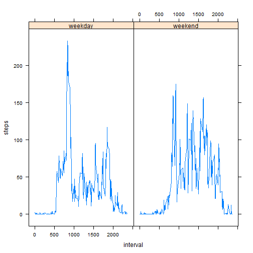

Peer Assessment 1 for Reproducible Research
========================================================

## Loading and preprocessing the data

I used the following code to unzip the data and to create the data.frame "activity" from the activity data set:


```r
if (!file.exists("activity.csv")) {
    unzip("activity.zip")
}
activity <- read.csv("activity.csv")
```


## What is mean total number of steps taken per day?
I've created a histogram of the total number of steps taken each day:


```r
dailysteps <- aggregate(steps ~ date, data=activity, sum)
hist(dailysteps$steps, xlab="Total Steps per Day", main="Frequency Histogram of Total Steps Per Day")
```

 

The following code calculates the mean and median of the total number of steps taken per day. 


```r
meansteps <- mean(dailysteps$steps)
mediansteps <- median(dailysteps$steps)
```

**Mean:**   1.0766 &times; 10<sup>4</sup>

**Median:** 10765

## What is the average daily activity pattern?


```r
stepsbyinterval <- aggregate(steps ~ interval, data=activity, mean)
plot(stepsbyinterval$interval,stepsbyinterval$steps, type="l", xlab="Interval", ylab="Average Number of Steps", main="Average Number of Steps by Interval")
```

 


Finding the interval with the most steps:


```r
max(stepsbyinterval$steps)
```

```
## [1] 206.2
```

```r
maxinterval <- subset(stepsbyinterval, steps>206, select=interval, drop=TRUE)
```

**The interval with the most steps, on average, is: 835**


## Imputing missing values

Calculate the total number of missing values in the data set:


```r
activity$missingvalues <- is.na(activity$steps)
sum(activity$missingvalues)
```

```
## [1] 2304
```


**The total number of missing values is 2304**


I've decided to replace all NA values with the mean value for that interval.  

I've created a function called getmeanstepsforinterval which returns the mean step for the interval.  I use the following code to create a new dataframe "activity2" which has the missing data filled in. 


```r
getmeanstepsforinterval <- function(x) stepsbyinterval[stepsbyinterval$interval==x, 2]

activity$stepsadj <- ifelse(activity$missingvalues, getmeanstepsforinterval(activity$interval), activity$steps)

activity2 <- data.frame(steps=activity$stepsadj, date=activity$date, interval=activity$interval)
```


Now, I'm going to make a histogram of the total number of steps taken each day so that I can compare it to the first histogram I made.  This way I can tell if filling in the missing values changed the data:


```r
dailysteps2 <- aggregate(steps ~ date, data=activity2, sum)
hist(dailysteps2$steps, xlab="Total Steps per Day", main="Frequency Histogram of Total Steps Per Day")
```

 

The following code calculates the mean and median of the total number of steps taken per day. 


```r
meansteps2 <- mean(dailysteps2$steps)
mediansteps2 <- median(dailysteps2$steps)
```

**Mean:**   1.0766 &times; 10<sup>4</sup>

**Median:** 1.0766 &times; 10<sup>4</sup>

As you can see, imputing the missing data had little effect on the mean and median.  It did effect the histogram though because there was more data to graph.  But the overall shape of the histogram remained the same.

## Are there differences in activity patterns between weekdays and weekends?


```r
activity2$date <- as.Date(activity2$date)
activity2$day <- sapply(activity2$date, weekdays)
activity2$typeofday <- ifelse(activity2$day=="Saturday" | activity2$day=="Sunday", "weekend", "weekday")
library(lattice)

weekdayact <- subset(activity2, typeofday=="weekday")
weekendact <- subset(activity2, typeofday=="weekend")
weekendave <- aggregate(steps ~ interval, data=weekendact, mean)
weekdayave <- aggregate(steps ~ interval, data=weekdayact, mean)
weekendave$type <- "weekend"
weekdayave$type <- "weekday"
b <- rbind(weekendave, weekdayave)
xyplot(steps ~ interval | type, data=b, type="l")
```

 
